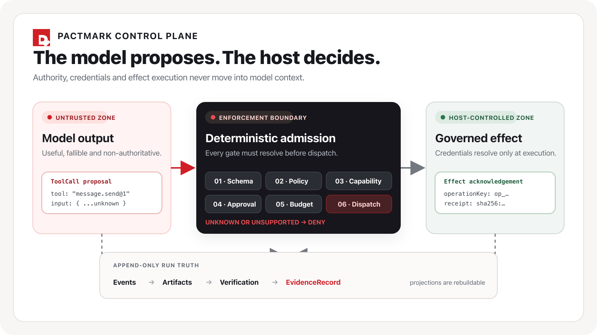
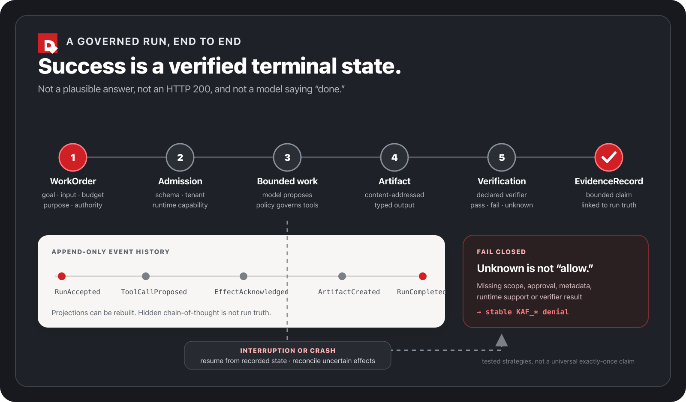

<p align="center">
  <a href="docs/tr/index.md">
    
  </a>
</p>

<h1 align="center">Pactmark</h1>

<p align="center"><strong>Yalnızca yanıt değil, kanıt bırakan kontrollü TypeScript agent’ları.</strong></p>

<p align="center">
  Doğrulanmış bir <code>WorkOrder</code>’ı sınırlandırılmış çalışma, kontrollü tool etkileri,<br>
  içerik adresli artifact’ler, tanımlı verification ve <code>EvidenceRecord</code> sonucuna dönüştürür.
</p>

<p align="center">
  <a href="https://github.com/lokomotifai/pactmark/actions/workflows/ci.yml"></a>
  <a href="https://github.com/lokomotifai/pactmark/actions/workflows/security.yml"></a>
  <a href="https://www.npmjs.com/package/@pactmark/agent"></a>
  <a href="https://github.com/lokomotifai/pactmark/releases/tag/v0.1.1"></a>
  <a href="LICENSE"></a>
</p>

<p align="center">
  <a href="https://nodejs.org/"></a>
  <a href="https://www.typescriptlang.org/"></a>
  <a href="docs/tr/index.md"></a>
  <a href="README.md"></a>
  <a href="https://github.com/lokomotifai/pactmark/stargazers"></a>
</p>

<p align="center">
  <a href="docs/tr/getting-started/first-agent.md"><strong>İlk agent’ı oluştur</strong></a>
  ·
  <a href="docs/tr/index.md"><strong>Dokümantasyonu oku</strong></a>
  ·
  <a href="examples/approval-agent/"><strong>Approval sınırını incele</strong></a>
  ·
  <a href="README.md"><strong>English</strong></a>
</p>

---

> **Model hiçbir zaman otorite değildir.** Bir tool çağrısı önerebilir; kendine
> scope veremez, kendi riskini onaylayamaz, credential çözümleyemez, bütçeyi
> genişletemez veya çıktısını doğrulanmış ilan edemez.

Pactmark, açık yetki altında sınırlandırılmış işler yapan agent’lar için
kanıt-yerel bir framework’tür. “Model makul bir şey döndürdü” ifadesinin başarı
tanımı olamayacağı sistemler için tasarlanmıştır.

**0.1.1**, public bir erken sürümdür. 19 npm paketinin tamamı uzun ömürlü npm
token’ı kullanılmadan trusted publishing ve package provenance ile yayımlandı;
ardından anonim olarak indirilen paketler immutable release checksum’larıyla
karşılaştırıldı. Bu, ilgili package byte’larının tedarik zinciri kanıtıdır;
Pactmark kullanan her deployment’ın production-ready veya güvenli olduğu iddiası
değildir.

## Tek görselde temel fark



<p align="center"><sub><a href="assets/readme/authority-boundary.svg">Erişilebilir SVG kaynağını görüntüle</a></sub></p>

Pek çok agent kütüphanesi model çağrısını ve tool bağlantısını kolaylaştırır.
Pactmark, o çağrının çevresindeki sorumluluğu tanımlar:

| Soru                                           | Pactmark’ın yanıtı                                                                                                |
| ---------------------------------------------- | ----------------------------------------------------------------------------------------------------------------- |
| Agent ne yapabilir?                            | Doğrulanmış iş sözleşmesi, default-deny policy, capability grant’leri, risk sınıfı ve bütçe belirler.             |
| Sonuç doğuran bir eylemi kim onaylar?          | Model metni değil; exact run ve effect’e bağlanmış, host tarafından üretilen karar.                               |
| Provider ve tool credential’ları nerede yaşar? | Host’un credential port’larının arkasında; çözümlenmiş değerler model context’ine veya sıradan evidence’a girmez. |
| Crash sonrasında ne olur?                      | Append-only run truth üzerinden durum yeniden kurulur; belirsiz effect kayıtlı stratejiyle reconcile edilir.      |
| Çalışma gerçekten ne üretti?                   | Tanımlı verifier sonuçlarına bağlı, içerik adresli artifact’ler.                                                  |
| Başka bir sistem neye güvenebilir?             | İddiası event ve verification sınırlarını aşmayan bir `EvidenceRecord`.                                           |

## 60 saniyede başla

Initializer, deterministic yerel bir agent oluşturur. Model anahtarı istemez ve
global npm ayarını değiştirmez.

```sh
npm create pactmark@latest -- my-agent
cd my-agent
npm run dev
```

Beklenen ilerleme kayıtları arasında şunlar bulunur:

```text
RunAccepted
ToolCallCompleted
VerificationRecorded(status=pass)
RunCompleted
```

Oluşturulan proje bilinçli olarak ephemeral local profile kullanır: in-memory
state, deterministic model fixture ve güvenilen in-process execution. Bu bir
öğrenme/test yoludur; production template’i gibi sunulmaz.

Eksiksiz ve typed örnek için
[`examples/minimal-tool-agent/src/example.ts`](examples/minimal-tool-agent/src/example.ts)
dosyasına bakın. Kaynak; tool ve agent tanımının yanında model güvenlik/kaynak
profillerini, authority issuer’ı, `WorkOrder`’ı, purpose ve data class’ı,
istenen capability’leri, bütçeleri ve command identity’yi açıkça tanımlar.

## Ürün sınırı run’dır



<p align="center"><sub><a href="assets/readme/run-lifecycle.svg">Erişilebilir SVG kaynağını görüntüle</a></sub></p>

Her run runtime’da doğrulanan bir `WorkOrder` ile başlar. Work order şunları
birbirine bağlar:

- agent identity ve version;
- goal ve typed input;
- principal, tenant, purpose, data class ve retention;
- work/autonomy mode ve human decision owner;
- talep edilen capability’ler; ve
- turn, model call, tool call, token, byte ve active-time bütçeleri.

Admission, bilinmeyen veya runtime’ın desteklemediği metadata’yı reddeder. Çalışma
boyunca model ve tool I/O güvenilmez kabul edilir. Önerilen bir effect, dispatch
öncesinde schema validation, policy, grant, risk, approval, budget ve runtime
capability kontrollerinden geçer. Terminal başarı, tanımlı verification yolunu
gerektirir; doğal dildeki “tamamlandı” beyanının otoritesi yoktur.

### “Exactly once” sloganı olmadan dayanıklılık

Pactmark append-only event’leri run truth olarak saklar; projection’ları yeniden
üretilebilir cache olarak görür. Durable profiller lease, operation key,
authorization reservation, acknowledgement, checkpoint ve kayıtlı
reconciliation/compensation stratejilerini kullanır.

Bu yapı, test edilen belirli stratejilerin belirli crash sınırlarında daha önce
alındısı kaydedilmiş effect’i tekrar etmesini engelleyebilir. Herhangi bir dış
API’yi evrensel olarak exactly-once hâle getirmez. Effect sonucunun belirsiz
olduğu ve stratejinin retry’ın güvenli olduğunu kanıtlayamadığı durumda Pactmark
sessizce yeniden dispatch etmek yerine fail closed davranır.

## Mimari

Portable kernel Node built-in’lerini, environment variable’ları, platform SDK’larını,
provider SDK’larını veya storage implementasyonlarını import etmez. Host ve vendor
davranışı açık adapter’lardan girer.

```text
application / host
        │
        ├── authority · credentials · scheduler · executor · network controls
        │
   @pactmark/agent        ergonomik composition
        │
   ┌────┴───────────────────────────────────────────────┐
   │ portable kernel                                   │
   │ core ── runtime ── policy ── evidence             │
   └────┬───────────────────────────────────────────────┘
        │ ports
   ┌────┴───────────────────────────────────────────────┐
   │ stores · protocols · model adapters · host bridges│
   └────────────────────────────────────────────────────┘
```

Dependency graph ve package sınırları
[`docs/architecture/dependencies.md`](docs/architecture/dependencies.md) içinde
belgelenir. Deep import ve cycle’lar repository kontrollerinde reddedilir.

### Package haritası

| Katman                         | Paketler                                                                          | Sorumluluk                                                                                            |
| ------------------------------ | --------------------------------------------------------------------------------- | ----------------------------------------------------------------------------------------------------- |
| Facade ve kernel               | `@pactmark/agent`, `core`, `runtime`, `policy`, `evidence`                        | Public composition, versioned contract’lar, orchestration, authority kuralları, artifact ve evidence. |
| Storage ve execution           | `store-memory`, `store-postgres`, `driver-postgres-worker`, `executor-in-process` | Ephemeral test, tenant-scoped durable state, worker loop ve güvenilen in-process tool execution.      |
| Interface’ler                  | `http`, `node`, `mcp`, `cli`                                                      | Web-standard HTTP/SSE, Node lifecycle, guarded MCP client ve terminal-safe command’lar.               |
| Platform/provider adapter’ları | `ai-sdk`, `vercel`, `cloudflare`, `otel`                                          | Vendor/platform dependency’lerini kernel’a taşımadan opt-in entegrasyon.                              |
| Contributor tooling            | `testing`, `create-pactmark`                                                      | Deterministic fake/contract suite’leri ve offline-capable initializer.                                |

Yalnızca host’unuzun sahip olduğu paketleri kurun. `@pactmark/agent` optional
provider, database, platform adapter veya telemetry paketlerini re-export etmez.

## Framework neyi korur, neyi koruyamaz?

- **Default deny:** bilinmeyen policy, scope, risk, metadata veya runtime desteği
  tahmin edilmez; reddedilir.
- **Her storage yolunda tenant:** tenant kimliği edge’de isteğe bağlı bir filtre
  değildir.
- **Credential’lar opaque kalır:** model ve normal diagnostics yalnızca referans
  alır, çözümlenmiş değerleri değil.
- **Human decision bağlıdır:** approval exact challenge, effect, tenant, grant ve
  expiry’ye scope edilir.
- **Evidence çalışma alanından daha dardır:** hidden chain-of-thought saklanmaz ve
  kanıt diye sunulmaz.
- **Host sorumluluğu devam eder:** network isolation, identity, secret storage,
  retention, backup, provider koşulları ve incident response bunları gerçekten
  uygulayan deployment’a aittir.

Pactmark genel amaçlı chat SDK’sı, no-code builder, swarm orchestrator, hosted
control plane veya production arbitrary-code sandbox değildir. Güvenilen
in-process executor bir isolation boundary değildir. Production-shaped host
değerlendirmeden önce [güvenlik modelini](docs/tr/security/security-model.md)
okuyun.

## Runtime ve platform durumu

| Yüzey                   | Mevcut kanıt                                                                                  | Sınır                                                                           |
| ----------------------- | --------------------------------------------------------------------------------------------- | ------------------------------------------------------------------------------- |
| Local memory runtime    | Deterministic unit, integration, consumer, replay, cancellation ve concurrency testleri       | Ephemeral development/test profili; production readiness false döner.           |
| PostgreSQL store/worker | Gerçek PostgreSQL migration, tenant, lease, checkpoint/resume, TLS ve crash-boundary kapıları | Database operations, scheduling, credential, backup ve isolation host’a aittir. |
| Node ve OCI             | HTTP/SSE contract’ları ve read-only, network-bounded local container conformance fixture      | Registry, multi-architecture veya production availability iddiası yoktur.       |
| Next.js / Vercel        | Adapter, route, auth-denial, UI security/accessibility ve geçmiş protected Preview kanıtı     | Güncel Vercel Production deployment veya production support iddiası yoktur.     |
| Cloudflare Workers      | Experimental Web-standard adapter, dry-run testleri ve ephemeral staging deployment           | Durable production gereksinimleri için readiness bilinçli olarak başarısızdır.  |
| MCP                     | Açık security metadata ile deterministic stdio ve HTTP client contract’ları                   | Uzak MCP server ve tool’ları güvenilmeyen dış sistemlerdir.                     |
| OpenTelemetry           | Opt-in, varsayılan metadata-only adapter testleri                                             | Export edilen veriyi host konfigürasyonu değiştirir ve ayrıca incelenmelidir.   |

Kesin command, tarih, digest ve açık eksikler
[`v0.1 readiness kaydında`](docs/releases/v0.1-readiness.md) yer alır. Bu kayıt
bilinçli olarak bir feature checklist’inden daha muhafazakârdır.

## Release bütünlüğü

- npm publication, GitHub Actions OIDC trusted publishing kullanır.
- Release candidate `pnpm verify` kapısından geçer.
- Paketler bağımsız consumer artifact’leri olarak pack edilir ve incelenir.
- Candidate tarball’lar tekrar üretilerek karşılaştırılır.
- Release; SHA-256 checksum, source/release manifest, CycloneDX SBOM, npm
  provenance ve GitHub attestation içerir.
- Public v0.1.1 tarball’ları anonim indirildi ve frozen release manifest ile
  eşleştirildi.

Immutable [v0.1.1 release](https://github.com/lokomotifai/pactmark/releases/tag/v0.1.1)
ve [release kanıtı](docs/releases/v0.1-readiness.md) incelenebilir. Provenance bir
artifact’in nereden geldiğini gösterir; davranışını sertifikalandırmaz.

## Repository’yi geliştir

Pactmark development için Node.js 24 ve pnpm 11.18.0 kullanır. Desteklenen
release satırları Node.js 22.14+ ve 24.x’tir.

```sh
corepack enable
pnpm install --frozen-lockfile
pnpm verify
```

`pnpm verify`; format, lint, strict type, build, unit/integration, packed
consumer, portability, example, PostgreSQL, crash/replay, OCI/platform contract,
API report, dependency boundary, security audit, SBOM, dokümantasyon ve release
dry-run kapılarını çalıştırır. Live provider çağrıları, external deployment ve
network-fresh advisory kontrolleri ayrı yetkilendirilmiş kapılardır.

Katkı göndermeden önce [CONTRIBUTING.md](CONTRIBUTING.md) dosyasını okuyun.

## Topluluk sözleşmesi

Pactmark bugün founder-led yönetilir. Governance modeli, yalnızca gerçek
contributor’lar açık bir scope’un sorumluluğunu almaya hazır olduğunda daha az
merkezî hâle gelecek şekilde kurulmuştur; hayalî komite veya contribution
sayısıyla otomatik yetki yoktur.

| Dosya                                    | Projenin taahhüdü                                                                                           |
| ---------------------------------------- | ----------------------------------------------------------------------------------------------------------- |
| [Contributing](CONTRIBUTING.md)          | Tekrarlanabilir setup, review standardı, DCO, AI-assisted contribution politikası ve acceptance kriterleri. |
| [Governance](GOVERNANCE.md)              | Roller, karar sınıfları, public RFC/ADR yolu, conflict, maintainer geçişi ve founder-led sınırlar.          |
| [Maintainers](MAINTAINERS.md)            | İsimler, scope’lar, hassas capability’ler ve doğrulanmış contact route’ları.                                |
| [Code of Conduct](CODE_OF_CONDUCT.md)    | Katılım standardı, private reporting, conflict ve ölçülü yaptırım basamakları.                              |
| [Security](SECURITY.md)                  | Desteklenen sürümler, private reporting, hedef response süreleri, safe harbor ve güvenlik sınırları.        |
| [Support](SUPPORT.md)                    | Doğru yardım yolu, gerekli reproduction bilgisi ve support sınırı.                                          |
| [Roadmap](ROADMAP.md)                    | Güncel yön ve Pactmark’ın bilinçli olarak vaat etmediği capability’ler.                                     |
| [İsim ve logo politikası](TRADEMARKS.md) | Endorsement veya resmîlik izlenimi vermeden adil topluluk kullanımı.                                        |

Commit’lerde [DCO 1.1](https://developercertificate.org/) sign-off gerekir; CLA
kullanılmaz. Code, documentation, translation, review, triage, test design ve
community care katkılarının tümü değerlidir.

## Lisans

Kaynak kod [Apache License 2.0](LICENSE) ile sunulur. Atıf bilgileri için
[NOTICE](NOTICE) ve [ORIGIN_AND_ATTRIBUTION.md](ORIGIN_AND_ATTRIBUTION.md)
dosyalarına bakın. Pactmark adı ve logosu ayrıca
[TRADEMARKS.md](TRADEMARKS.md) ile yönetilir; lisans modified distribution’ın
resmî Pactmark release’i gibi sunulmasına izin vermez.

---

<p align="center"><strong>İşi sınırla. Otoriteyi modelin dışında tut. Sonucu doğrula.</strong></p>
